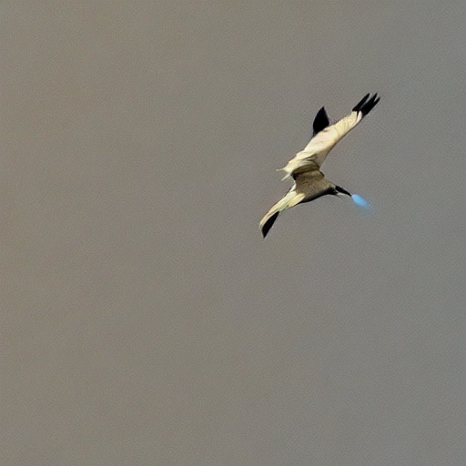

# AI Image Generator

A web application that generates images using Stable Diffusion AI model. The application provides a simple interface where users can enter text prompts to generate corresponding images.

## Architecture

The application consists of:
- Frontend: A Node.js web server serving a simple HTML/JavaScript interface
- Backend: A Python script using the Stable Diffusion model for image generation

## Technology Stack

- **Frontend**: Node.js, Express.js
- **Backend**: Python, Diffusers library
- **AI Model**: CompVis/stable-diffusion-v1-4

## Installation

1. Clone this repository
2. Install Node.js dependencies:
   ```bash
   npm install
   ```
3. Install Python dependencies:
   ```bash
   pip3 install diffusers torch transformers
   ```

## Usage

1. Start the server:
   ```bash
   node server.js
   ```
2. Open your browser and navigate to `http://localhost:3000`
3. Enter a text prompt and click "Generate" to create an image

## Image Generation Details

### Model Information
The application uses the `CompVis/stable-diffusion-v1-4` model, which is a lighter version of Stable Diffusion optimized for faster generation while maintaining good quality output.

### Parameters
- **Image Size**: 512x512 pixels
- **Inference Steps**: 20 (balanced for speed and quality)
- **Guidance Scale**: 7.5 (controls how closely the image follows the prompt)
  - Higher values (>7.5) produce images that more strictly follow the prompt but might be less creative
  - Lower values (<7.5) allow more creative freedom but might deviate from the prompt

### Safety Features
The model includes built-in safety features through the Stable Diffusion pipeline:
1. **Safety Checker**: Enabled by default in `StableDiffusionPipeline` and cannot be disabled. This component:
   - Filters out NSFW content
   - Screens prompts for harmful or inappropriate content
   - Blocks generation of unsafe images

The safety checker runs automatically during image generation and requires no additional configuration.

## Example Images

Here are some example images generated by the application:




## Notes
- The application runs the model on CPU for compatibility, which means generation might take a few minutes
- For faster generation, consider using a GPU if available
- The guidance scale can be adjusted in the code for different creative results
